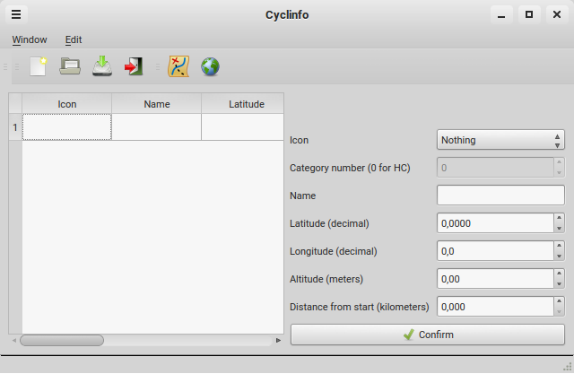

# Cyclinfo

## What's ?

GUI Software to make cycling maps and graphs, created with C++ and Qt library (or maybe GTKmm 4.1 soon).

This software is in developpment, please add issues when the 0.1 will be published.

## Who ?

* [AirSThib](https://airsthib.github.io)
* [Florian COLLIN](https://florian-collin.github.io)

## Contribute to Cyclinfo...

[Check instructions here](https://github.com/AirSThib/Cyclinfo/tree/master/CONTRIBUTING.md)

